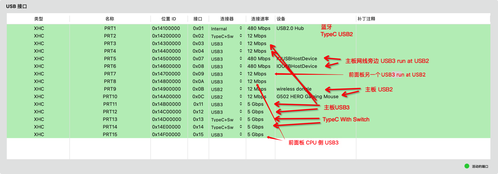
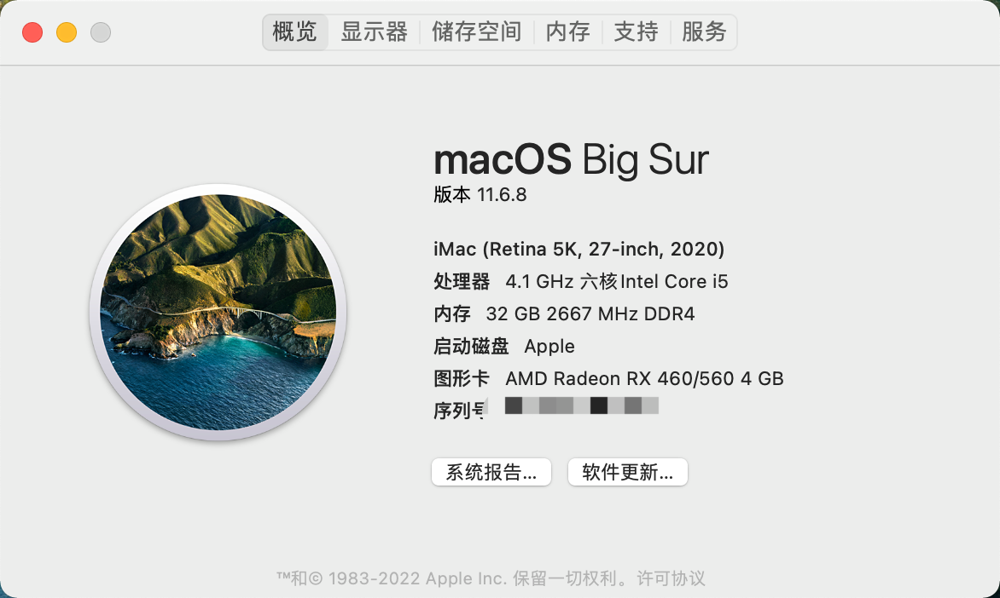
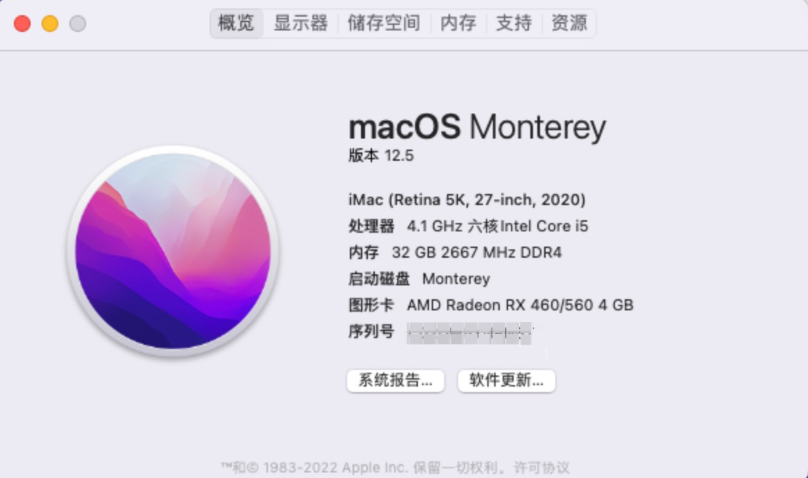
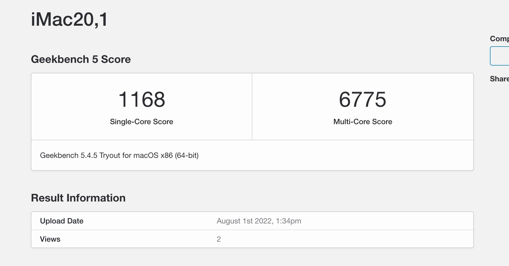
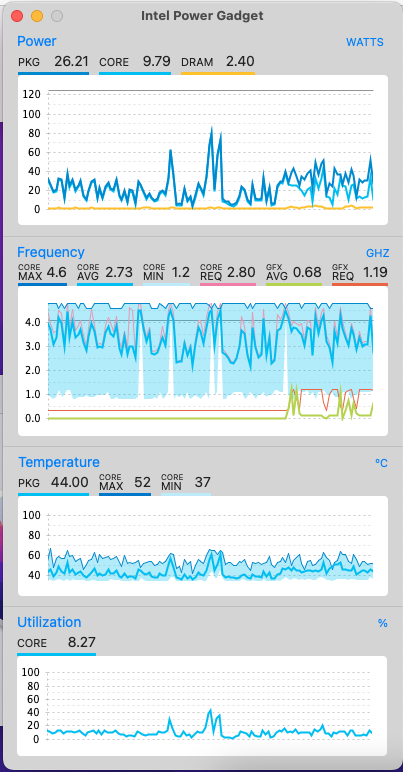
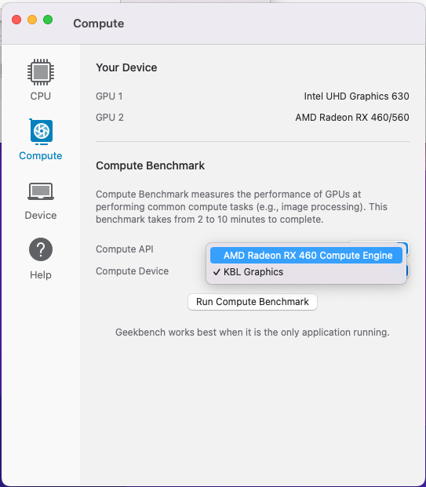
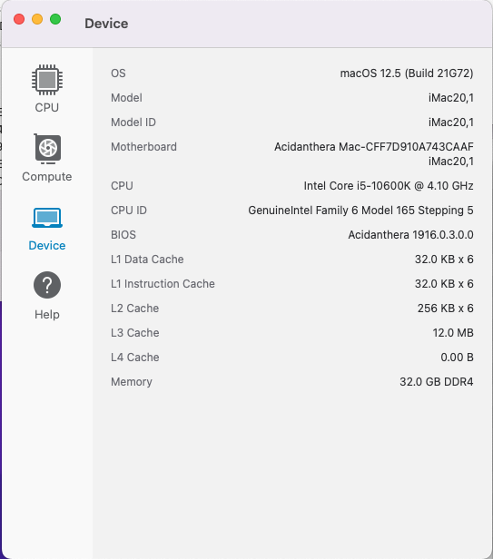
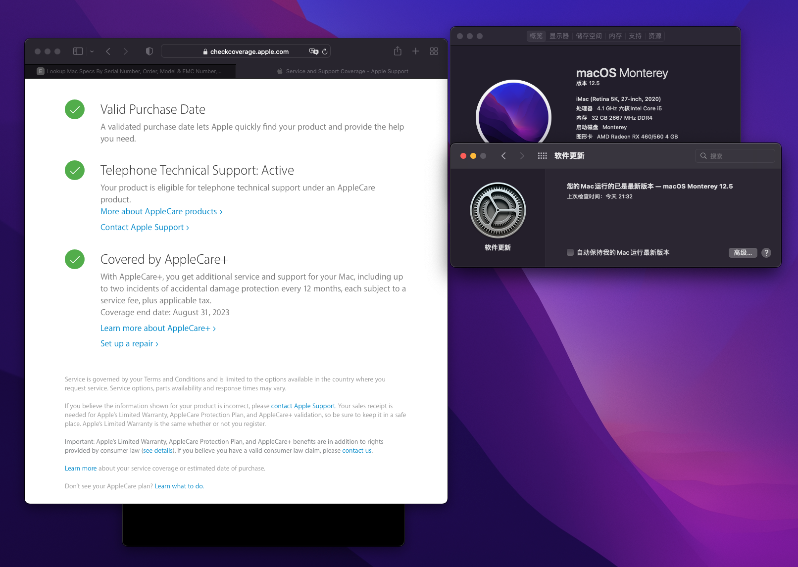

# AsRock_B460M_PRO_Monterey_Hackintosh_OC

> 支持引导 BigSur 和 Monterey  

AsRock B460M Pro, i5 10600K, OC 0.8.3, Monterey 12.5, BigSur 11.6.8

## 基本信息

* OpenCore: 0.8.3 DEBUG
* MacOS
  * BigSur 11.6.8
  * Monterey 12.5

## Hackintosh + OpenCore 0.8.3

* https://dortania.github.io/OpenCore-Desktop-Guide
* https://www.sqlsec.com/tags/%E9%BB%91%E8%8B%B9%E6%9E%9C/
* https://apple.sqlsec.com/
* https://github.com/3Alan/Hackintosh-i5-10400-B460M-MORTAR-WIFI

## TODO
- [x] 测试黑果完美程度
- [x] USB 定制
- [x] 清理OC工具
- [x] 移除部分DEBUG信息

## Work

* 图形界面EFI
* 核显硬件加速
* USB端口识别（已定制）
* WIFI
* 蓝牙
* 隔空投送
* 集显DP输出
* 独显DP输出
* 主板+显卡风扇转速显示
* 主板+显卡温度显示

### 未测试
* 睡眠/唤醒（台式机目前没有休眠需求
* 声卡输出



## 硬件

* 见：https://iitii.github.io/2021/09/10/1/
* GPU 使用 UHD630集显和蓝宝石 RX460 OC 4GB 版本，都有视频输出（因为RX460只有一个 DP 接口，不够用。。。

## 三码自行替换

```xml
<dict>
	<key>AdviseFeatures</key>
	<false/>
	<key>MaxBIOSVersion</key>
	<false/>
	<key>MLB</key>
	<string>xxxxxxxxxxxxxxx</string>
	<key>ProcessorType</key>
	<integer>0</integer>
	<key>ROM</key>
	<data>vfCqhr8c</data>
	<key>SpoofVendor</key>
	<true/>
	<key>SystemMemoryStatus</key>
	<string>Auto</string>
	<key>SystemProductName</key>
	<string>iMac20,1</string>
	<key>SystemSerialNumber</key>
	<string>xxxxxxxxxxx</string>
	<key>SystemUUID</key>
	<string>xxxxxxxx-xxxxx-xxxxx-xxxx-xxxxxxxx</string>
</dict>
```


## BIOS 设置
* 见：https://iitii.github.io/2021/09/10/1/

## 非EFI问题及解决方案

* 为了方便拍错，默认打开DEBUG，日志输出到启动所用的 EFI 分区

* HIDPI: https://github.com/xzhih/one-key-hidpi
* 亮度调节工具（前提是显示器支持调节）: https://github.com/MonitorControl/MonitorControl

* windows和mac时间不同步问题 windows下管理员身份运行命令
```pwsh
Reg add HKLM\SYSTEM\CurrentControlSet\Control\TimeZoneInformation /v RealTimeIsUniversal /t REG_DWORD /d 1
```
* windows/mac 蓝牙设备共用需要重新配对的问题 解决方案：https://www.reddit.com/r/hackintosh/comments/mtvj5m/howto_keep_bluetooth_devices_paired_across_macos/

> 当然也有现成的脚本：https://github.com/digitalbirdo/BT-LinkkeySync  

## 更新记录
### 2022.08.03
* USB 定制
* OpenCore 0.8.3
### 2022.08.02
* Monterey 蓝牙修复
* USB 定制初版
* 移除 部分 DEBUG 信息
* 清理多余 Drivers 和 Tools
* 完美度测试
### 2022.07.30
* 初版

## 成果










