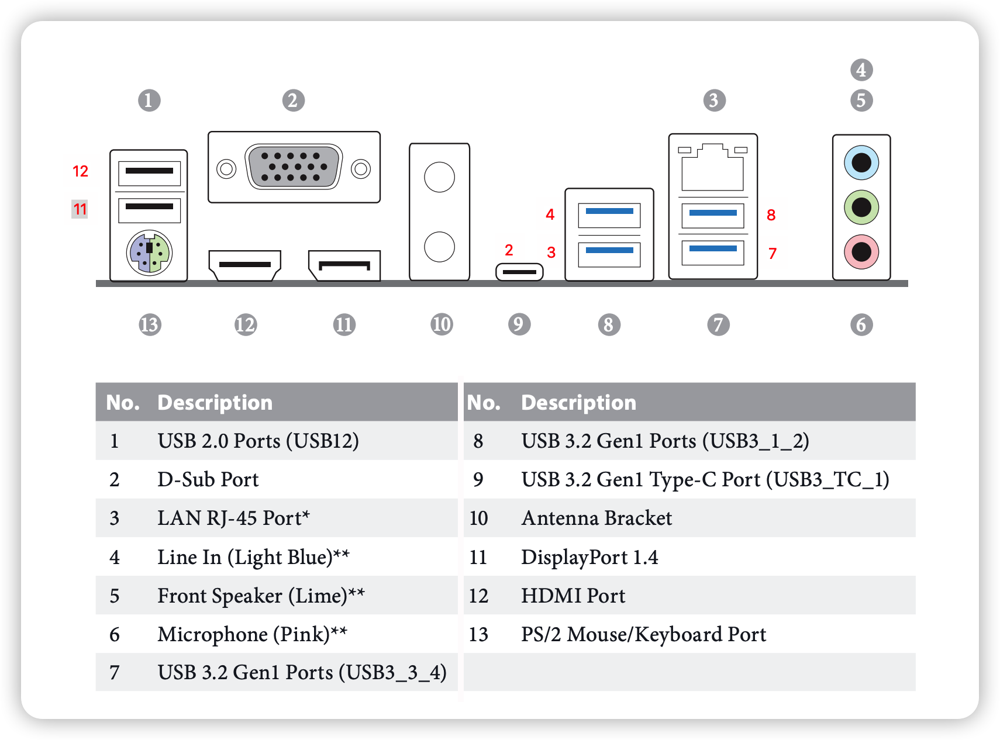
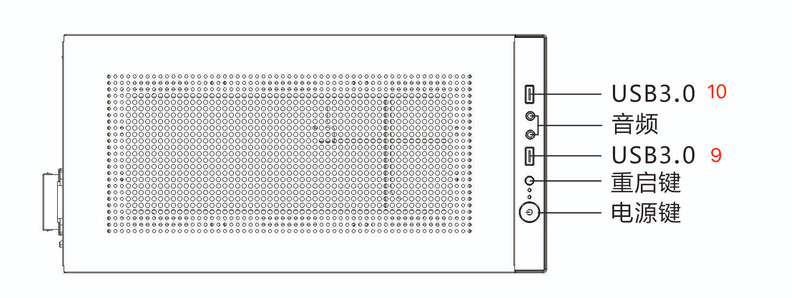
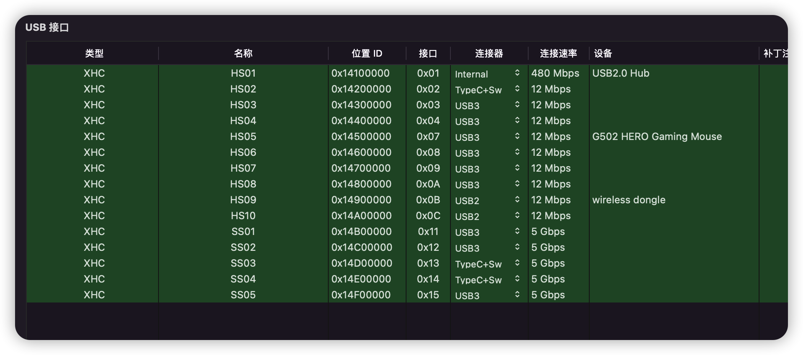

# USB  
> 请使用 Windows + USBToolBox 进行USB接口定制，不要用PE。。。  

## 接口详情

## 对照表
> 占用地址对应 HackIntool USB 接口地址, 但是进制不一样  

> 地址为 0x01 的接口为内部蓝牙专用，不能屏蔽  
> 暂时约定 TypeC 插入时 logo 和电源键同侧为正，否则为反  

| 接口编号 | 接口类型 | USB2占用地址 | USB3 占用地址 |
| :------: | :------: | :----------: | :-----------: |
|    1     | Internal |      1       |       -       |
|    2     | TypeC+Sw |      2       | 20(正)19(反)  |
|    3     |   USB3   |      3       |      17       |
|    4     |   USB3   |      4       |      18       |
|    7     |   USB3   |      7       |      23       |
|    8     |   USB3   |      8       |      24       |
|    9     |   USB3   |      9       |      21       |
|    10    |   USB3   |      10      |      22       |
|    11    |   USB2   |      11      |       -       |
|    12    |   USB2   |      12      |       -       |

## 定制过程
### 2022.08.03

### 2022.08.02

## Refer
* https://download.asrock.com/Manual/B460M%20Pro4.pdf
* https://apple.sqlsec.com/6-%E5%AE%9E%E7%94%A8%E5%A7%BF%E5%8A%BF/6-1.html?h=usb
